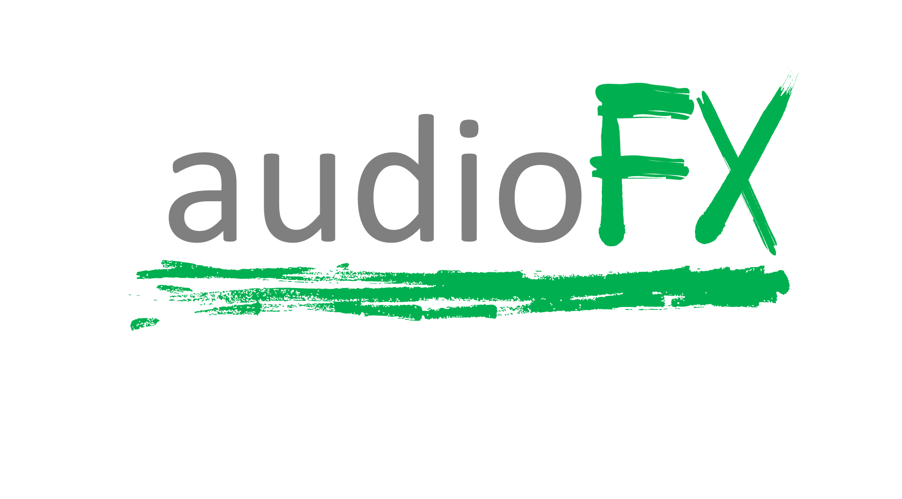

# audioFX - A Python Library for Audio Effects

## 1. Description
This python package contains functionality to apply a variety of effects to audio data.  
[GitHub Repository](https://github.com/hcmlab/audio-fx) | 
[PyPi Repository](https://pypi.org/project/audioFX/)


## 2. Installation
Install via pip:
```
pip install audioFX
```

## 3. Get started
Here is a basic example on how to load a wave file, apply some effects and save the resulting audio:
```
from audioFX.Fx import Fx
from librosa import load
import soundfile

infile = 'test.wav'
outfile = 'my_processed_audio_file.wav'

x, sr = load(infile)

fx = Fx(sr)

fx_chain = {"tremolo": 0.8,
              "flanger": 0.2
              }

optional_parameters = {"flanger_frequency": 0.75,
                         "flanger_depth": 9.75,
                         "flanger_delay": 0.9375
                         }

y = fx.process_audio(x, fx_chain, optional_parameters)
soundfile.write(outfile, y, sr)

```

First, with "from audioFX.Fx import Fx" you import the FX processor of the audioFX library.  
Instantiate the FX processor with fx = Fx(sr), where sr is the samplerate of the audio you work with.

You define an effect chain through a dictionary. In the example above, the audio is first fed through a tremolo module, and then through a flanger module.
The values that are assigned to the single effects correspond to the dry/wet portion of the effect. A value of 0 will result in the effect turned completely off, while 1 will result in a completely processed signal.
The effects are applied in the order in which you defined them in that dictionary. See the next section for all possible effects.

You can (but don't have to) define an additional dictionary in which you pass further parameters to your effects chain. 
All possible parameters are listed in the next section.

Apply the effect chain by calling the process_audio function as shown above. 

## 4. Implemented Effects

Currently, audio-fx supports the effect types listed in the table below. We are actively about to include more effects, please drop an issue if you are interested in a particular one.

| **Effect Type** | **Description**                                                                                                                                                                                                            |
|-----------------|----------------------------------------------------------------------------------------------------------------------------------------------------------------------------------------------------------------------------|
| flanger         | A classical flanger effect.                                                                                                                                                                                                |
| wahwah          | Wahwah periodically blends in a low pass filter.                                                                                                                                                                           |
| tremolo         | A classical tremolo effect.                                                                                                                                                                                                |
| distortion      | Distorts the signal.                                                                                                                                                                                                       |
| chorus          | A classical chorus effect.                                                                                                                                                                                                 |
| pitch           | Pitch shift on the original signal.  By using the dry/wet value in the effect chain, the original pitch and shifted pitch signals are merged together.                                                                     |
| griffin         | This effect applies an sftf to the signal and converts the signal back by using the griffin-lim algorithm.  By restricting the iterations of griffin-lim (see optional parameters), you can achieve pretty robotic sounds. |
| timestretch     | This effect allows you to make your audio slower/faster. Note: with this effect, the dry/wet value does work differently! It does not specify the portion of the effect, but the stretch-factor. E.g., if you set the value 2.0, the audio will be played in double speed.


As described above, you can instantiate a dictionary to define further parameters for the effect chain.
Possible parameters are listed below. For parameters that are not specified, the default will be taken.

| **Parameter**     | **Type** | **Affected Effect Type:** | **Description**                                                                     | **Default** |
|-------------------|----------|---------------------------|-------------------------------------------------------------------------------------|-------------|
| flanger_frequency | float    | flanger                   | Frequency of flanger                                                                | 1.0         |
| flanger_depth     | float    | flanger                   | Depth of flanger                                                                    | 10.0        |
| flanger_delay     | float    | flanger                   | Delay of flanger                                                                    | 1.0         |
| chorus_frequency  | float    | chorus                    | Frequency of chorus                                                                 | 2.0         |
| chorus_depth      | float    | chorus                    | Depth of chorus                                                                     | 0.9         |
| chorus_delay      | float    | chorus                    | Delay of chorus                                                                     | 25.0        |
| tremolo_alpha     | float    | tremolo                   | Alpha of tremolo                                                                    | 1.0         |
| tremolo_modfreq   | float    | tremolo                   | Frequency of tremolo                                                                | 10.0        |
| distortion_alpha  | float    | distortion                | Degree of distortion                                                                | 5.0         |
| wahwah_damp       | float    | wahwah                    | Damping factor of wahwah                                                            | 0.49        |
| wahwah_minf       | float    | wahwah                    | Minimum frequency                                                                   | 100.0       |
| wahwah_maxf       | float    | wahwah                    | Maximum frequency                                                                   | 2000.0      |
| wahwah_wahf       | float    | wahwah                    | Frequency of wahwah bandpass modulation                                             | 2000.0      |
| pitch_semitones   | float    | pitch                     | Number of semitones to shift the signal                                             | 12.0        |
| pitch_mirror      | bool     | pitch                     | If True, pitch shift is additionally applied in the other direction.                | False       |
| griffin_iters     | int      | griffin                   | Number of iterations of the griffin-lim reconstruction. The less, the more robotic. | 0           |
## 5. Acknowledgements
Parts of the code are derived from https://github.com/wybiral/python-musical and https://github.com/gened1080/guitar-effects.